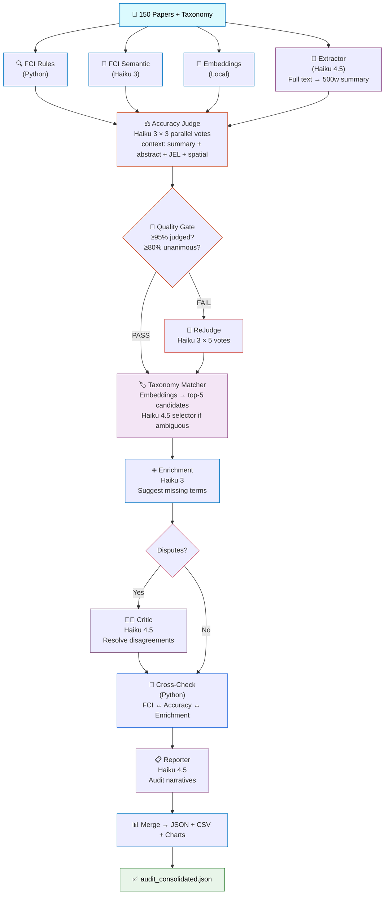

# IDB Metadata Audit Pipeline v5

The Inter-American Development Bank maintains a catalog of over 13,000 working papers, each tagged with taxonomy terms from the IdBTopics controlled vocabulary. Over time, inconsistencies accumulate — papers get tagged with terms that don't reflect their actual content, relevant terms are missing, and metadata fields are incomplete or invalid. Manual auditing at this scale is impractical.

This pipeline automates that audit. It reads the IDB's JSON-LD metadata, evaluates every paper↔term assignment using a combination of rule-based checks and LLM judges, identifies incorrect and missing tags, and produces a consolidated report with actionable recommendations. The system uses a multi-voter approach where each taxonomy assignment is independently evaluated three times, with majority vote determining the verdict, ensuring reliability beyond what a single evaluation could provide.

## How it works

The pipeline processes each paper through several stages. First, it extracts a structured 500-word summary from the full paper text using an LLM, which provides richer context than the abstract alone. It also resolves JEL classification codes and geographic coverage URIs into human-readable labels. This enriched context — summary, abstract, keywords, JEL codes, and spatial coverage — is then passed to the accuracy evaluator, which judges whether each assigned taxonomy term genuinely describes the paper's content.

For terms judged as Incorrect or Partial, the system searches the existing 472-term taxonomy for a better match using embedding similarity. When multiple candidates are close, a disambiguation agent selects the best one based on the paper's actual content. If no suitable match exists in the current taxonomy, the term is flagged as a potential new category.

In parallel, the pipeline runs a completeness index (FCI) that checks for missing required fields, validates URLs and dates, and detects language mismatches. A semantic quality layer evaluates whether the abstract is informative, keywords are meaningful, and geographic coverage is consistent. Finally, a cross-check module looks for contradictions between all these signals — for instance, a paper where all terms are "Correct" but the FCI says keywords are missing.
flowchart TD



## Tiered Model Usage

| Node | Model | Role | Est. Calls | 
|------|-------|------|------------|
| FCI Semantic | Haiku 3 | Quality scoring | 150 |
| Extractor | **Haiku 4.5** | Summarize full text | 150 |
| Accuracy (×3 parallel votes) | Haiku 3 | Term evaluation | ~3,800 |
| ReJudge (×5 votes, if needed) | Haiku 3 | Disputed terms | ~75 |
| Taxonomy Matcher selector | **Haiku 4.5** | Disambiguate candidates | ~80 |
| Enrichment | Haiku 3 | Candidate eval | ~1,200 |
| Critic | **Haiku 4.5** | Resolve disputes | ~15 |
| Reporter | **Haiku 4.5** | Audit narratives | 20 |

Haiku 3 handles high-volume tasks ($0.25/MTok input). Haiku 4.5 handles reasoning-intensive tasks ($1/MTok input).

## Quick Start

```bash
# Install dependencies
pip install -r requirements.txt

# Run pipeline
python main.py --api-key sk-ant-your-key --sequential

# Custom settings
python main.py --api-key sk-ant-your-key --sequential \
    --papers path/to/working_papers_metadata.json \
    --taxonomy path/to/taxonomy_labels.json \
    --output path/to/output_dir \
    --n-votes 3 --max-workers 20 --n-report 20
```

### Arguments

| Flag | Default | Description |
|------|---------|-------------|
| `--api-key` | `$ANTHROPIC_API_KEY` | Anthropic API key (required) |
| `--papers` | `data/working_papers_metadata.json` | Path to papers JSON-LD |
| `--taxonomy` | `data/taxonomy_labels.json` | Path to taxonomy JSON-LD |
| `--output` | `outputs/` | Output directory |
| `--n-votes` | `3` | Votes per term in accuracy |
| `--max-workers` | `20` | Parallel API threads |
| `--n-report` | `20` | Number of worst papers to generate reports for |
| `--sequential` | `false` | Run without LangGraph (recommended for now) |

### Post-processing

After a run, fix escaped slashes and optionally shorten URIs for readability:

```bash
python fix_outputs.py --input-dir outputs/ --shorten-uris
```

This creates `*_clean.json` / `*_clean.csv` files alongside the originals.

## Output Files

### Main deliverable

**`audit_consolidated_{timestamp}.json`** — One entry per paper with all audit results:

```
[
  {
    "paper_id":                  Paper URL or shortened URI
    "title":                     Paper title
    "date_published":            Publication date
    "n_pages":                   Page count
    "n_authors":                 Number of authors
    "knowledge_product_category": Resolved label (e.g. "Working Paper")
    "language":                  "en", "es", "pt", "fr"
    "jel_codes":                 Resolved JEL labels (e.g. ["Q54 - Climate..."])
    "geographic_coverage":       Resolved country/region names

    "fci_score":                 0-1, rule-based field completeness index
    "semantic_scores": {
      "abstract":                0-1, abstract quality
      "keywords":                0-1, keywords relevance
      "geo":                     0-1, geographic consistency
      "title":                   0-1, title descriptiveness
    }

    "original_terms": [          One entry per assigned taxonomy term
      {
        "uri":                   Taxonomy term URI
        "label":                 Human-readable label
        "verdict":               "Correct" | "Partial" | "Incorrect" | "Disputed"
        "score":                 0-1, relevance score
        "agreement":             0-1, inter-vote agreement
        "justification":         LLM explanation
        "action":                "KEEP" | "REVIEW" | "REMOVE"
        "suggested_replacement": {       (only for Incorrect/Partial)
          "label":               Replacement term label
          "source":              "existing_taxonomy" | "new_category"
          "taxonomy_uri":        URI if matched to existing term
          "confidence":          Embedding similarity or LLM confidence
          "reasoning":           Why this replacement
        }
      }
    ]

    "suggested_additions": [     Terms to add (from enrichment)
      {
        "label":                 Term label
        "uri":                   Taxonomy URI
        "source":                "existing_taxonomy"
        "confidence":            LLM confidence
        "rationale":             Why add this term
      }
    ]

    "metadata_flags":            Issues from FCI rules (e.g. "MISSING_REQUIRED:...")
    "crosscheck_flags":          Cross-module contradictions
    "overall_score":             0-1, weighted composite
    "overall_status":            "Excellent" | "Acceptable" | "Needs Work"
    "report":                    Audit narrative (for worst papers only)
  }
]
```

### Detail files

| File | Format | Description |
|------|--------|-------------|
| `accuracy_detail_{ts}.json` | JSON | Every paper↔term evaluation: score, verdict, justification, alternative, taxonomy match |
| `enrichment_detail_{ts}.json` | JSON | Every enrichment candidate: embedding score, LLM decision, justification |
| `summary_{ts}.csv` | CSV | One row per paper with aggregated scores (for quick analysis and charting) |

### Charts

Generated in `outputs/charts/` and `outputs/chart_data/`:

| Chart | Shows |
|-------|-------|
| `01_fci_distribution` | Distribution of FCI completeness scores |
| `02_llm_verdicts` | Count of Correct / Partial / Incorrect verdicts |
| `03_llm_scores` | Distribution of LLM relevance scores |
| `04_llm_agreement` | Vote agreement distribution |
| `05_top_issues` | Most frequent metadata issues |
| `06_enrichment_actions` | ADD / SKIP / REVIEW breakdown |
| `07_overall_status` | Excellent / Acceptable / Needs Work pie chart |
| `08_worst_papers` | Papers with most incorrect terms |
| `09_fci_semantic` | Semantic quality score distributions |
| `10_top_incorrect_terms` | Most frequently incorrect taxonomy terms |
| `audit_dashboard_v4.png` | Combined 6-panel dashboard |

### Understanding the verdicts

| Verdict | Score Range | Meaning | Action |
|---------|------------|---------|--------|
| **Correct** | 0.7 – 1.0 | Term accurately describes the paper | KEEP |
| **Partial** | 0.4 – 0.6 | Term is tangentially related | REVIEW — consider replacing with a more precise term |
| **Incorrect** | 0.0 – 0.3 | Term does not describe the paper | REMOVE — replacement suggested if available |
| **Disputed** | varies | Voters disagreed, Critic resolved | Check `critic_verdict` for final decision |

### Understanding the scores

| Score | Weight | Source | What it measures |
|-------|--------|--------|-----------------|
| `fci_score` | 30% | Rule-based | Field completeness, validity, consistency |
| `pct_correct` | 50% | LLM | % of terms that are Correct or Partial |
| `sem_mean` | 20% | LLM | Abstract, keywords, title, geographic quality |
| **`overall_score`** | 100% | Weighted | `0.30×FCI + 0.50×Accuracy + 0.20×Semantic` |

## Project Structure

```
├── main.py                     Entry point, sequential pipeline runner
├── config.py                   All parameters, models, thresholds
├── fix_outputs.py              Post-processing: fix encoding, shorten URIs
├── requirements.txt
├── data/
│   ├── working_papers_metadata.json    Input: IDB papers (JSON-LD)
│   └── taxonomy_labels.json            Input: IDB taxonomy (JSON-LD)
├── cache/
│   ├── taxonomy_embeddings.npy         Cached taxonomy vectors
│   └── taxonomy_uris.json              Cached taxonomy URI-label mapping
├── src/
│   ├── nodes.py                All 14 pipeline node functions
│   ├── llm_engine.py           LLM calls: tool_use, rate limiter, parallel N-vote
│   ├── data_loader.py          JSON-LD parser, text cleaner, JEL/spatial resolvers
│   ├── embedding_scorer.py     Sentence-transformer embeddings
│   ├── consistency_checker.py  FCI rule-based field checks
│   ├── charts.py               Visualization generation
│   ├── graph.py                LangGraph orchestrator (Schema 3)
│   └── pipeline_state.py       TypedDict shared state definition
└── outputs/                    Generated by pipeline
```

## Design Decisions

Every LLM call in the pipeline uses Anthropic's `tool_use` with forced `tool_choice`, which guarantees the response conforms to a predefined JSON schema. This eliminates the fragile regex parsing and prompt engineering that earlier versions relied on to extract structured data from free-text responses. The result is 100% parse success rate across thousands of calls.

The accuracy evaluation uses a parallel 3-vote majority system. Each paper↔term pair is independently evaluated three times in simultaneous threads, and the majority verdict wins. This catches cases where a single evaluator might misjudge a borderline term — the disagreement itself becomes a useful signal. Terms where voters disagree below 67% are automatically escalated to a more capable model (Haiku 4.5) acting as a "Critic" with override authority.

A global token-bucket rate limiter controls API throughput at 15 calls per second, staying safely below the Tier 2 limit of 1,000 calls per minute. This prevents the silent retry cascades that plagued earlier versions, where exceeding rate limits caused exponential backoff delays that tripled pipeline runtime without any visible errors.

The taxonomy matching system avoids the cost of sending all 472 taxonomy terms in every prompt. Instead, it pre-computes embeddings for the full taxonomy and uses cosine similarity to find the top-5 candidates for each suggested alternative. When only one candidate matches above the 0.70 threshold, it's selected directly. When multiple candidates are close, a Haiku 4.5 agent evaluates them in context and picks the best one. This keeps the cost near zero for the matching step while ensuring alternatives are grounded in the existing taxonomy rather than invented by the LLM.

## Requirements

- Python 3.10+
- Anthropic API key (Tier 2+ recommended for rate limits)
- ~4GB RAM (for sentence-transformers model)
- ~90 minutes runtime for 150 papers, ~$5 API cost

---

**Developed by [nodalab.ai](https://nodalab.ai)** — Daniel Navas, Daniel Bustamante

Licensed under MIT. Built for the Inter-American Development Bank.
